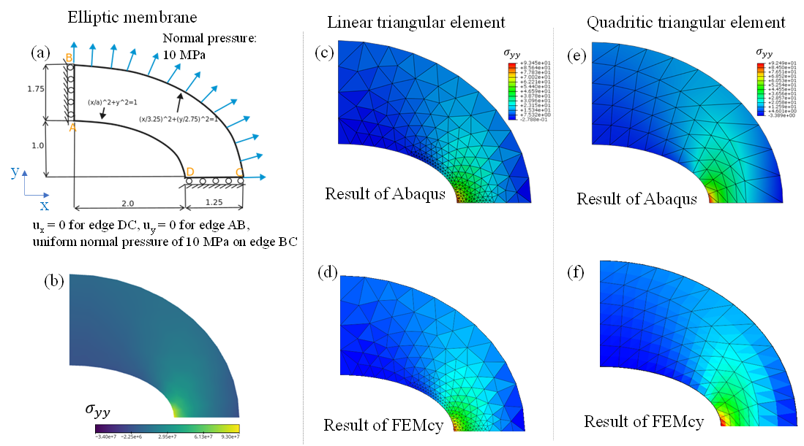

# FEMcy    
## an open-source **finite element** solver with cross-platform **parallel** (CPU/**GPU**) computing
---
FEMcy is a finite element solver for **structural static/dynamic analysis** in **continuum mechanics**, powered by cross-platform parallel (CPU/GPU) computing language of **Taichi**. FEMcy provides an alternative option besides Abaqus. Compared to the widely-used finite element softwares such as Abaqus, Ansys and COMSOL, we present the FEMcy which is flexible for customized needs by open-source. The conventional black-box of computational structural analysis (**CSD**) is now opened for you to stare at the mechanism behind it, and manipulate it to fit your customized needs. Compared to the open-source finite element softwares such as CalculiX or OOFEM, we provide the implementation on GPU parallel computing, meanwhile maintain the friendly readability by Python language. 
---
## Features
+ finite element benchmark problems [https://cofea.readthedocs.io/en/latest/benchmarks/004-eliptic-membrane/model.html](https://cofea.readthedocs.io/en/latest/benchmarks/004-eliptic-membrane/model.html)
+ both small deformation and large deformation (geometric nonlinearity) are enabled
+ friendly readability by Python, parallel by **Taichi**
+ material nonlinearity (customize your constitutive model)
+ many types of elements including second-order elements
+ Dirichlet boundary condition (BC) and Neumann BC are enabled

## Installation and Usage
1. install Python (3.8+) and pip, then install Taichi and numpy
> pip install numpy  
> pip install taichi
2. git clone this project
3. go to the current directory of this project, and run the code by:
> python ./main.py
4. Pre-processing: choose an .inp file (the Abaqus-input-file-format) which defines the geometry, mesh, material and boundary condition for structual analysis. The .inp file can be obtained by Abaqus pre-processing GUI. 
   For example, insert the path and inp file name to the command line:

    >  **please give the .inp format's input file path and name:**  ./tests/abaqus_test/beam_deflection/load800_largeDef/beamDeflec_quadPSE_largeD_load800_fixX.inp

    more examples of inp files can be found at ./tests folder  
5. after convergence, the deformed body colored by mises-stress (defaultly) is showed at the window.
## Examples (some benchmark problems) 
### 1. elliptic-membrane with constant pressure

Fig. 1 shows the geometric and consititutive model definition of elliptic membrane problem, which can be refered to [CoFEA benchmark](https://cofea.readthedocs.io/en/latest/benchmarks/004-eliptic-membrane/model.html). The stress $\sigma_{yy}$ at point D is expected to be 92.7 MPa. 

+ boundary condition and loading condition

> $u_{x}$ = 0 for edge DC, $u_{y}$ = 0 for edge AB,
> uniform normal pressure of 10 MPa on edge BC

|        property        |       value       | unit |
| :--------------------: | :---------------: | :--: |
|   Young's modulus, E   | $2.1\times10^{5}$ | MPa  |
| Poisson's ratio, $\nu$ |        0.3        |  -   |

#### Results are showed below:

 Fig. 1  Results of elliptic membrane under normal pressure. (a) geometric model definition; (b) results from <a href=https://cofea.readthedocs.io/en/latest/benchmarks/004-eliptic-membrane/model.html>CoFEA</a>; (c, d) results of linear triangular element from Abaqus and FEMcy respectively; (e, f) results of quadratic triangular element from Abaqus and FEMcy respectively. 

Results of simulation:

| $\sigma_{yy}$  [MPa] | linear element | quadratic element |
| :------------------: | :------------: | :---------------: |
|        Abaqus        |     93.45      |       92.67       |
|        FEMcy         |     93.56      |       94.88       |

corresponding .inp file:

+ linear element:

> ./tests/ellip_membrane_linEle_localVeryFine.inp

+ quadratic element:

> ./tests/ellip_membrane_quadritic_trig_neumann.inp

results can be compared with [https://cofea.readthedocs.io/en/latest/benchmarks/004-eliptic-membrane/model.html](https://cofea.readthedocs.io/en/latest/benchmarks/004-eliptic-membrane/model.html)
### 2. comparison of small and large deformation by beam-deflection
For a horizontal beam ([see problem definition](https://www.comsol.com/blogs/what-is-geometric-nonlinearity)), when fix x-displacement of two ends, and impose y-directional force on one end, the y-displacement will shows large deviation between small deformation and large deformation.   
+ small deformation
    > ./tests/abaqus_test/beam_deflection/load800_smallDef/beamDeflec_quadPSE_largeD_load800_fixX.inp

    you can compare the FEMcy results with Abaqus result: ./tests/abaqus_test/beam_deflection/load800_smallDef/beamDeflec_quadPSE_smallD_load800_fixX.inp

+ large deformation
    > ./tests/abaqus_test/beam_deflection/load800_largeDef/beamDeflec_quadPSE_largeD_load800_fixX.inp

    FEMcy result can be compared with Abaqus result: ./tests/abaqus_test\beam_deflection\load800_largeDef\beamDeflec_quadPSE_largeD_load800_fixX.odb
### 3. Cook's membrane
This part is on-going. 
## Future work
+ more types of boundary conditions, such as periodic-boundary-condition (PBC) by Lagrangian-multiplier method is on-going
+ multiphysics, general PDE solver
+ dynamic analysis
+ flexible adaptive-mesh (local-refinement dynamically)
+ contact and friction (maybe powered by the fasionable [IPC (incremental potential contact)](https://ipc-sim.github.io/) someday)
+ support more file-formats for pre-processing, such as Ansis input file format. Or even develop a pre-processing GUI for you to define the geometry, mesh, material, boundary conditions, etc.
+ support more sophisticated post-processing of the output data, such as output data file for VTK visulization or ParaView visulization. 

## References
+ An Introduction to the Finite Element Method [https://www.comsol.com/multiphysics/finite-element-method](https://www.comsol.com/multiphysics/finite-element-method)
+ FEM vs. FVM [https://www.comsol.com/blogs/fem-vs-fvm/](https://www.comsol.com/blogs/fem-vs-fvm/) 
+ What Is Geometric Nonlinearity? [https://www.comsol.com/blogs/what-is-geometric-nonlinearity/](https://www.comsol.com/blogs/what-is-geometric-nonlinearity/)
+ Abaqus documentation [http://130.149.89.49:2080/v6.14/](http://130.149.89.49:2080/v6.14/)
+ Taichi documentation [https://docs.taichi-lang.org/docs/](https://docs.taichi-lang.org/docs/)
+ Preconditioned conjugate gradient method [https://www.cs.cmu.edu/~quake-papers/painless-conjugate-gradient.pdf](https://www.cs.cmu.edu/~quake-papers/painless-conjugate-gradient.pdf), page 40
+ 刘天添老师 太极图形课：弹性物体仿真 [https://www.bilibili.com/video/BV1nr4y1Q73e?spm_id_from=333.337](https://www.bilibili.com/video/BV1nr4y1Q73e?spm_id_from=333.337)
+ awesome examples of other simulation methods from awesome-taichi [https://github.com/taichi-dev/awesome-taichi](https://github.com/taichi-dev/awesome-taichi)

