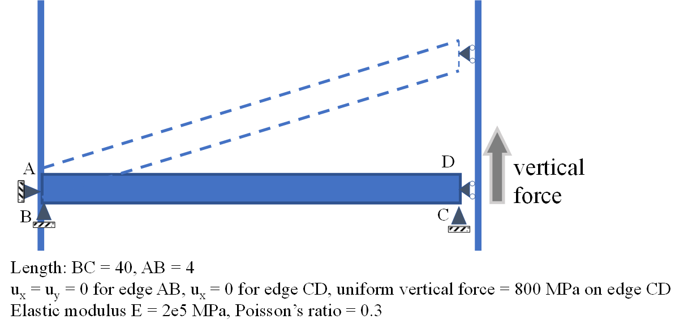

# FEMcy    
## an open-source **finite element** solver with cross-platform **parallel** (CPU/**GPU**) computing
FEMcy is a finite element solver for **structural analysis** in **continuum mechanics**, powered by cross-platform parallel (CPU/GPU) computing language of [**Taichi**](https://www.taichi-lang.org/). FEMcy is flexible for customized needs by open-source. The mechanism behind computational structural analysis (**CSD**) is now opened for you, and can be manipulated by you to meet your customized needs. We provide the implementation on GPU parallel computing, meanwhile maintain the friendly readability by Python language. 

|  |  |
| :----------------------------------------------------------: | :----------------------------------------------------------: |

## Features
+ both small deformation and large deformation (geometric nonlinearity) are enabled
+ friendly readability by Python, parallel by [**Taichi**](https://www.taichi-lang.org/)
+ material nonlinearity (customize your constitutive model)
+ many types of elements including second-order elements
+ Dirichlet boundary condition (BC) and Neumann BC are enabled

## currently supported Elements
+ linear trianguler element (CPE3 and CPS3)
+ quadratic trianguler element (CPE6 and CPS6)
+ linear quadrilateral element (CPS4 and CPE4)
+ quadratic quadrilateral element (CPS8 and CPE8)
+ linear tetrahedral element (C3D4)
+ quadratic tetrahedral element (C3D10, noted: this could take 5 minutes of compile time due to large ti.Matrix)

## Installation and Usage
1. install Python (3.8+) and pip, then install Taichi and numpy
> pip install numpy  
> pip install taichi
2. git clone this project
3. go to the current directory of this project, and run the code by:
> python ./main.py
4. Pre-processing: choose an .inp file (the Abaqus-input-file-format) which defines the geometry, mesh, material and boundary condition for structual analysis. The .inp file can be obtained by Abaqus pre-processing GUI. 
   For example, insert the path and inp file name to the command line:

    >  **please give the .inp format's input file path and name:**  tests/beam_deflection/load800_freeEnd_largeDef/beamDeflec_quadPSE_largeD_load800.inp

    more examples of inp files can be found at ./tests folder  
5. after convergence, the deformed body colored by mises-stress (defaultly) is showed at the window.
## Examples (some benchmark problems) 
### 1. elliptic-membrane with constant pressure

Fig. 1 shows the geometric and consititutive model definition of elliptic membrane problem, which can be refered to [CoFEA benchmark](https://cofea.readthedocs.io/en/latest/benchmarks/004-eliptic-membrane/model.html). The stress $\sigma_{yy}$ at point D is expected to be 92.7 MPa. 

+ boundary condition and loading condition

> $u_{x}$ = 0 for edge DC, $u_{y}$ = 0 for edge AB,
> uniform normal pressure of 10 MPa on edge BC

|        property        |       value       | unit |
| :--------------------: | :---------------: | :--: |
|   Young's modulus, E   | $2.1\times10^{5}$ | MPa  |
| Poisson's ratio, $\nu$ |        0.3        |  -   |

#### Results are showed below:

 Fig. 1  Results of elliptic membrane under normal pressure. (a) geometric model definition; (b) results from <a href=https://cofea.readthedocs.io/en/latest/benchmarks/004-eliptic-membrane/model.html>CoFEA</a>; (c, d) results of linear triangular element from Abaqus and FEMcy respectively; (e, f) results of quadratic triangular element from Abaqus and FEMcy respectively, shown by nodal stress extrapolated from integration points. 

Results of simulation:

| $\sigma_{yy}$  [MPa] at point D | linear element |          quadratic element           |                                    |
| :-----------------------------: | :------------: | :----------------------------------: | :--------------------------------: |
|                                 |                | $\sigma_{yy}$ at node (extrapolated) | $\sigma_{yy}$ at integration point |
|             Abaqus              |     93.45      |                93.34                 |               84.42                |
|              FEMcy              |     93.56      |                93.32                 |               84.40                |
|         relative error          |     0.12%      |                0.021%                |               0.024%               |

The relative error shown above is the error between results of Abaqus and FEMcy, indicating that the results of these two softwares are almost the same. 

Another interesting point is that, the linear element needs a very locally-refined mesh to get close to the expected result (~ 92.7 MPa), whereas the quadratic triangular element can get the accurate result at a relative coarse mesh as shown in the above figure. 

corresponding **.inp file**:

+ linear element:

> ./tests/elliptic_membrane/element_linear/ellip_membrane_linEle_localVeryFine.inp

+ quadratic element:

> ./tests/elliptic_membrane/element_quadratic/ellip_membrane_quadritic_trig_neumann.inp

results can be compared with [https://cofea.readthedocs.io/en/latest/benchmarks/004-eliptic-membrane/model.html](https://cofea.readthedocs.io/en/latest/benchmarks/004-eliptic-membrane/model.html)
### 2. comparison of small and large deformation by beam-deflection
For a horizontal beam ([see problem definition](https://www.comsol.com/blogs/what-is-geometric-nonlinearity)), when fix x-displacement of two ends, and impose y-directional force on one end, the y-displacement will shows large deviation between small deformation and large deformation.  

 Fig. 2 Beam deflection problem, an ideal example to show great difference with and without consideration of geometric nonlinearity. One end is fixed and another end can move along vertical directional. Large vertical distributed force acts on the movable end to deflect the beam. It's expected that as the loading force goes higher and higher, the displacement at the right end is much smaller with consideration of geometric nonlinearity. 

Fig. 3 The deformed configurations (each frame is a step in Newton's method) and the final static equilibrium configuration, colored by mises-stress, and computed by FEMcy with consideration of geometric nonlinearity.  

Table: maximum y-displacement for difference cases

| y-displacement | small deformation (without geometric nonlinearity) | large deformation (with geometric nonlinearity) |
| :------------: | :------------------------------------------------: | :---------------------------------------------: |
|     Abaqus     |                       16.46                        |                      6.40                       |
|     FEMcy      |                       18.52                        |                      6.55                       |

you can see that the results (max y-displacement) show huge differences between small-deformation and large-deformation. 

+ .inp file for small deformation
    > ./tests/beam_deflection/load800_smallDef/beamDeflec_quadPSE_smallD_load800_fixX.inp

    you can compare the FEMcy results with Abaqus result: ./tests/abaqus_test/beam_deflection/load800_smallDef/beamDeflec_quadPSE_smallD_load800_fixX.inp

+ .inp file for large deformation
    > ./tests/beam_deflection/load800_largeDef/beamDeflec_quadPSE_largeD_load800_fixX.inp

    FEMcy result can be compared with Abaqus result: ./tests/abaqus_test\beam_deflection\load800_largeDef\beamDeflec_quadPSE_largeD_load800_fixX.odb

### 3. Twist Plate

Run `Python main.py` and then insert the .inp file `tests/twist/twist_plate_C3D4.inp` or `tests/twist/twist_plate_C3D10.inp` to the command line.

| C3D4 linear Tetrahedral | C3D10 quadratic tetrahedral |
| :----------------------------------------------------------: | :----------------------------------------------------------: |
|  |  |

Fig. 4 Twist plate with C3D4 and C3D10 element respectively, colored by Mises stress.  

## Future work
+ accelerate by TaichiMesh.
+ more types of boundary conditions, such as periodic-boundary-condition (PBC) by Lagrangian-multiplier method is on-going
+ multiphysics, general PDE solver
+ dynamic analysis
+ flexible adaptive-mesh (local-refinement dynamically)
+ contact and friction by penalty method or Lagrange multiplier method.
+ support more file-formats for pre-processing, such as Ansys input file format. Or even develop a pre-processing GUI for you to define the geometry, mesh, material, boundary conditions, etc.
+ support more sophisticated post-processing of the output data, such as output data file for VTK visulization or ParaView visulization. 

## References
+ An Introduction to the Finite Element Method [https://www.comsol.com/multiphysics/finite-element-method](https://www.comsol.com/multiphysics/finite-element-method)
+ FEM vs. FVM [https://www.comsol.com/blogs/fem-vs-fvm/](https://www.comsol.com/blogs/fem-vs-fvm/) 
+ What Is Geometric Nonlinearity? [https://www.comsol.com/blogs/what-is-geometric-nonlinearity/](https://www.comsol.com/blogs/what-is-geometric-nonlinearity/)
+ Abaqus documentation [http://130.149.89.49:2080/v6.14/](http://130.149.89.49:2080/v6.14/)
+ Taichi documentation [https://docs.taichi-lang.org/docs/](https://docs.taichi-lang.org/docs/)
+ Claes Johnson, Numerical solutions of PDEs by finite element method [https://cimec.org.ar/foswiki/pub/Main/Cimec/CursoFEM/johnson_numerical_solutions_of_pde_by_fem.pdf](https://cimec.org.ar/foswiki/pub/Main/Cimec/CursoFEM/johnson_numerical_solutions_of_pde_by_fem.pdf)
+ Preconditioned conjugate gradient method [https://www.cs.cmu.edu/~quake-papers/painless-conjugate-gradient.pdf](https://www.cs.cmu.edu/~quake-papers/painless-conjugate-gradient.pdf), page 40
+ Solution techniques for non-linear finite element problems [https://onlinelibrary.wiley.com/doi/epdf/10.1002/nme.1620121106](https://onlinelibrary.wiley.com/doi/epdf/10.1002/nme.1620121106)
+ Taichi courses of deformable objects [https://www.bilibili.com/video/BV1eY411x7mK?spm_id_from=333.337](https://www.bilibili.com/video/BV1eY411x7mK?spm_id_from=333.337)
+ awesome examples of other simulation methods from awesome-taichi [https://github.com/taichi-dev/awesome-taichi](https://github.com/taichi-dev/awesome-taichi)

